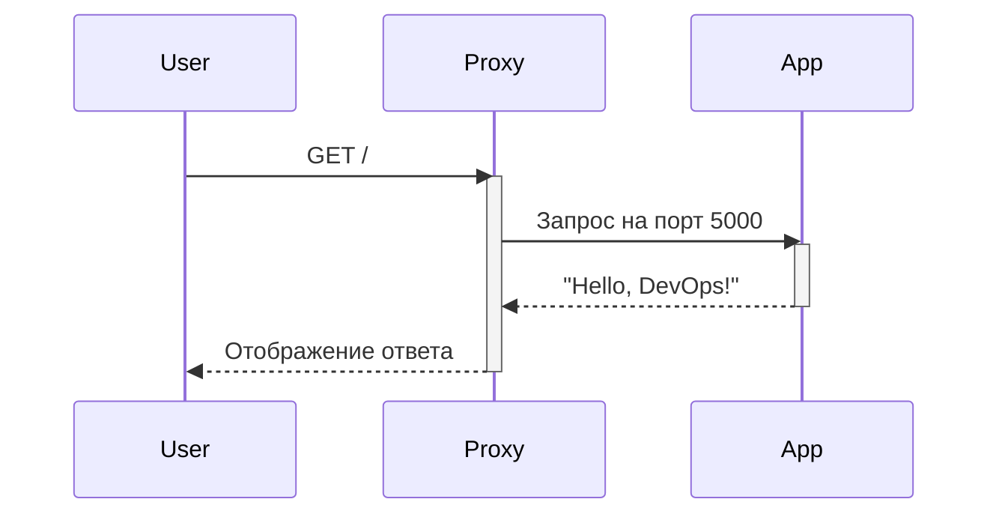

# Docker-контейнеризация приложения с прокси-серверами (Nginx/Apache/HAProxy)

## 📋 Исходное задание
**Уровень:** Junior  
**Инструменты:** Docker • Docker Compose • Python • Nginx  

**Задача:**  
Создать Docker-образ для Python-приложения (Flask), отображающего "Hello, DevOps!", и настроить Nginx как обратный прокси. Реализовать связку через Docker Compose.

**Технические требования:**
1. Написать `Dockerfile` для Python-приложения
2. Настроить Nginx-контейнер с проксированием на порт приложения
3. Создать `docker-compose.yml` для совместного запуска
4. **Критерии:**
   - Приложение доступно на `localhost:80`
   - Логи приложения выводятся в `stdout`
   - *(Дополнительно)* Реализованы конфигурации для Apache и HAProxy

---

## 🚀 Реализация
Реализовано **3 варианта** развертывания Flask-приложения:
1. **Базовое решение с Nginx** (соответствует ТЗ)
2. **Расширенная версия с Apache**
3. **Расширенная версия с HAProxy**

### 🔍 Соответствие требованиям
| Критерий               | Nginx | Apache | HAProxy |
|------------------------|-------|--------|---------|
| Доступ на порту 80     | ✅    | ✅     | ✅      |
| Логи в stdout         | ✅    | ✅     | ✅      |
| Проксирование         | ✅    | ✅     | ✅      |
| Дополнительные фичи   | —     | Автоподгрузка модулей | Балансировка нагрузки |

---

## 🏗️ Структура проекта

.
├── apache_app/               # Конфигурация с Apache
│   ├── app/
│   │   ├── app.py            # Flask-приложение
│   │   ├── requirements.txt  # Зависимости Python
│   │   └── Dockerfile        # Dockerfile для приложения
│   ├── apache/
│   │   ├── Dockerfile        # Dockerfile для Apache
│   │   └── my-site.conf      # Конфигурация виртуального хоста
│   └── docker-compose.yml    # Docker Compose для Apache
│
├── HAproxy_app/              # Конфигурация с HAProxy
│   ├── app/
│   │   ├── app.py            # Flask-приложение
│   │   ├── requirements.txt  # Зависимости Python (включая Gunicorn)
│   │   └── Dockerfile        # Dockerfile с Gunicorn
│   ├── haproxy/
│   │   └── haproxy.cfg       # Конфигурация HAProxy
│   └── docker-compose.yml    # Docker Compose для HAProxy
│
└── nginx_app/                # Конфигурация с Nginx
    ├── app/
    │   ├── app.py            # Flask-приложение
    │   ├── requirements.txt  # Зависимости Python
    │   └── Dockerfile        # Dockerfile для приложения
    ├── nginx/
    │   └── nginx.conf        # Конфигурация Nginx
    └── docker-compose.yml    # Docker Compose для Nginx

---

## 🛠️ Инструкции по запуску 
**Важно:** Используется синтаксис `docker compose` (без дефиса)

### 1. Базовое решение (Nginx)
```bash
cd nginx_app && docker compose up --build
```
**Проверка:** Откройте [http://localhost](http://localhost)

### 2. Расширенные конфигурации
```bash
# Apache
cd apache_app && docker compose up --build

# HAProxy 
cd HAproxy_app && docker compose up --build
```

---

## 🔄 Логика работы


---

## 💡 Особенности реализации
### Для всех вариантов:
- **Единая кодовая база** приложения
- **Оптимизированные Docker-образы** (многоэтапная сборка, Alpine-версии)
- **Автоматический перезапуск** контейнеров (`restart: always`)

### Индивидуальные оптимизации:
| Прокси    | Особенность                          | Пример кода                     |
|-----------|--------------------------------------|---------------------------------|
| Nginx     | Передача клиентских IP-адресов       | `proxy_set_header X-Real-IP`    |
| Apache    | Автовключение модулей                | `sed -i '/proxy_module/s/^#//'` |
| HAProxy   | Балансировка нагрузки                | `balance roundrobin`            |

---
